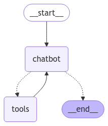

# Chatbot API with LangGraph and OpenAI

This project provides a FastAPI-based API for interacting with a chatbot built using the LangGraph library and OpenAI's GPT model. It includes functionality for processing conversational states and integrating internet search results into chatbot interactions via the Tavily search tool.




## Features
- FastAPI-based chatbot service.
- Conversational state management using LangGraph's `StateGraph`.
- Integration of OpenAI's GPT-4 mini model via the `langchain-openai` package.
- Ability to perform internet searches using the Tavily search tool.
- Memory-saving capabilities with LangGraph's `MemorySaver` to manage conversation history.
- Conditional routing in the conversation flow based on tool usage.

## Prerequisites

Before running this project, ensure that you have the following installed:
- Python 3.10 or higher
- Docker (for containerization)

## Installation

To get started with the project, follow these steps:

### 1. Clone the Repository

```bash
git clone https://github.com/your-username/chatbot-api.git
cd chatbot-api
```
### 2. Create a virtual environment
```bash
python3 -m venv venv
source venv/bin/activate
pip install -r requirements.txt
```
### 3. Install dependencies
```bash
pip install -r requirements.txt
```
### 4. Set environment variables
In order to be able to communicate with Tavily and openai the user needs first to obtain some api keys and set them as environment variables.
```bash
export OPENAI_API_KEY=xyz
export TAVILY_API_KEY=abc
```
### 5. Run the application
Once everything is installed the application can be ran.
```bash
uvicorn main:app --reload
```

## Run the dockerize application (Optional)
Instead of installing everything, another option is to use the compose file to run the dockerized image.
It is still needed to have the api keys set as environment values.
```bash
docker-compose up --build
```

## 6. Testing the API

The API has the following routes:

### 1. Home Route

**GET /**  
A simple route to test if the API is running.

**Response:**

```json
{
  "message": "Hello world"
}
```

### 2. Home Route

**GET /healthy**  
A simple route to test if the API is running.

**Response:**

```json
{
  "message": "Hello world"
}
```

### 3. Chatbot interaction

**POST /chatbot**  
Send a prompt to the chatbot along with a user thread to get a response. The prompt is sent to the AI model, which processes the input and returns a response.
The thread is optional, and one would be assigned if it is not chosen.

**Request body:**

```json
{
  "prompt": "Hello, how are you?",
  "thread": "abc123"
}
```


**Response:**

```json
{
  "response": "I'm doing well, thank you!"
}

```

